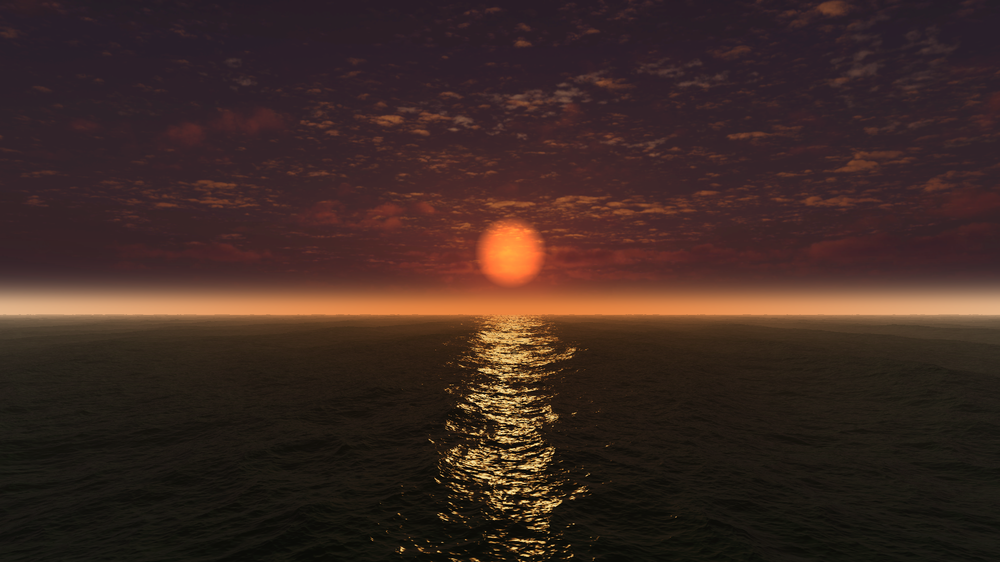
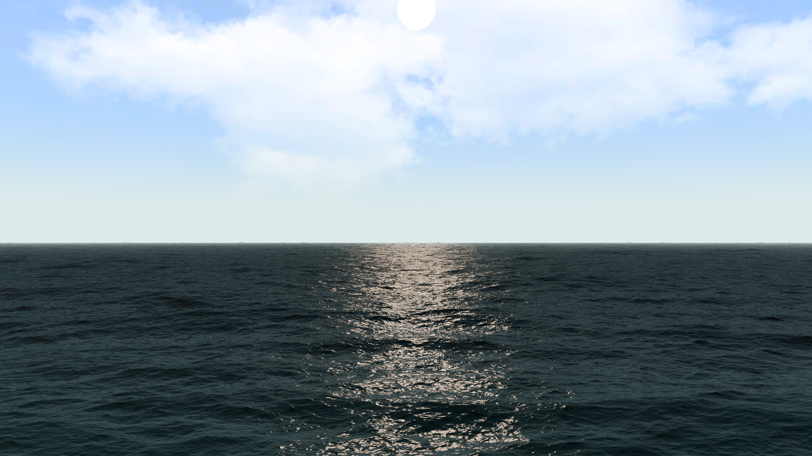
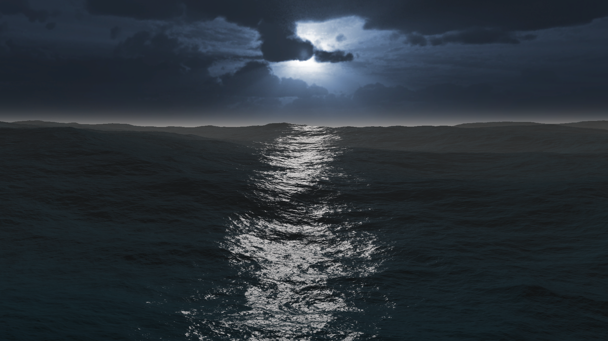
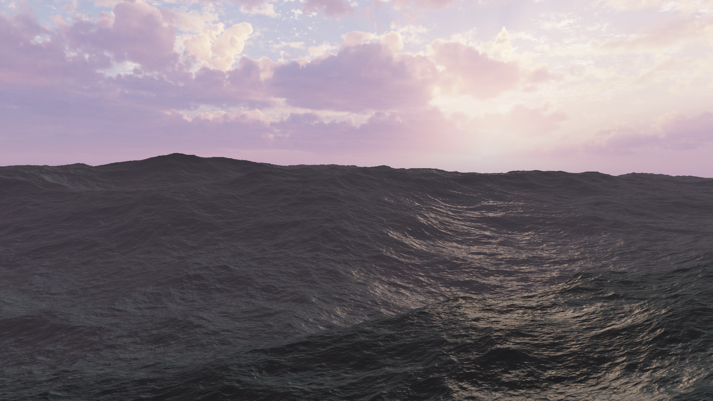
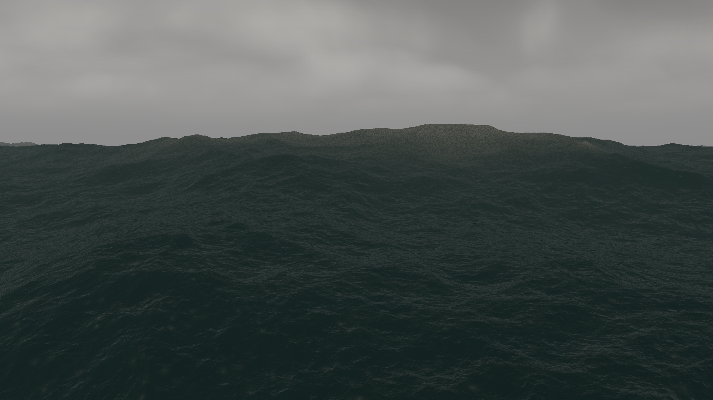
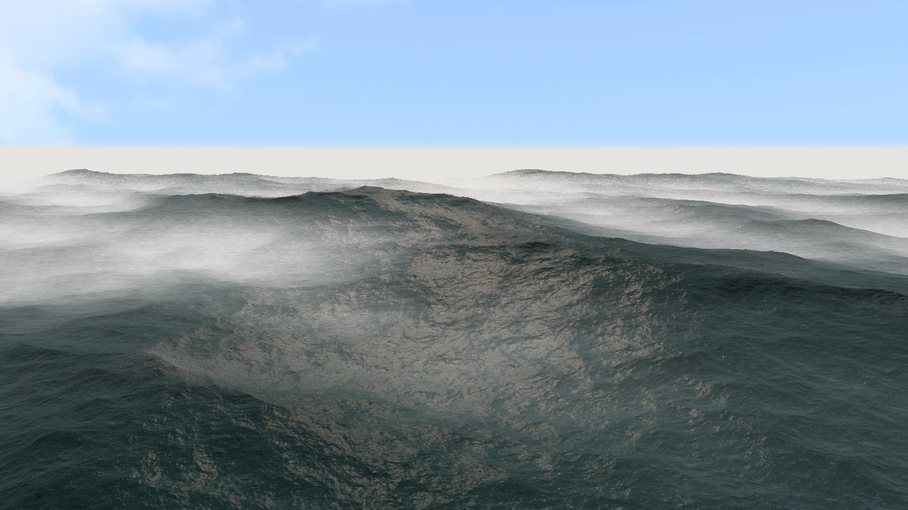
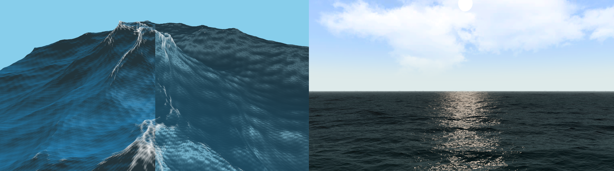
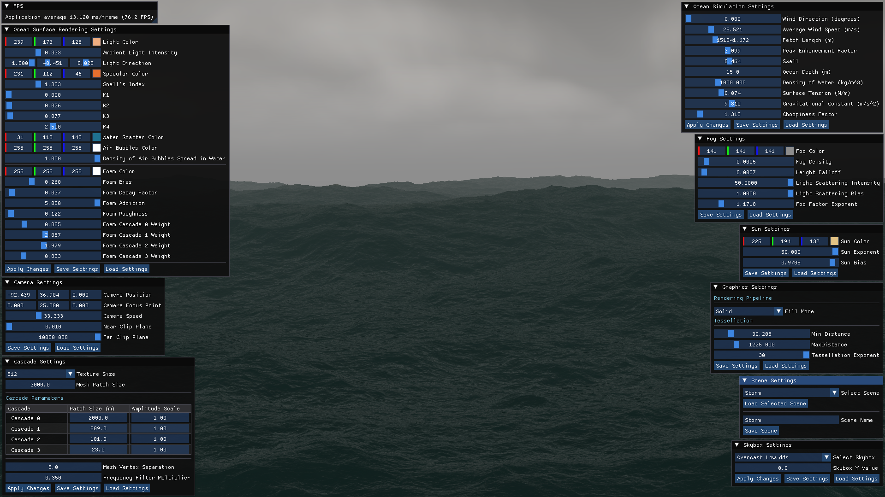

# 🌊 Real-Time FFT Ocean Simulation


A real-time, statistically-driven ocean surface simulation written from scratch in **C++** and **DirectX 11**.

Grounded in Jerry Tessendorf's spectral wave methods and the JONSWAP oceanographic spectrum, the project moves the entire mathematical cost of simulating a realistic, non-repeating ocean onto the GPU through a **Fast Fourier Transform (FFT)** compute pipeline, dynamic hardware tessellation and a physically based microfacet shading model.

> This README focuses on the ocean simulation and rendering pipeline specifically. The custom DirectX 11 engine that hosts it (managers, object/lifecycle abstractions, the post-processing framework) is documented separately, as it is a project in its own right.

---

## 🎥 Visual Showcase
<video src="https://github.com/Jokin110/OceanSimulation/raw/refs/heads/main/videosAndScreenshots/oceanSimulation.mp4" autoplay loop muted playsinline style="max-height:640px; width:100%;"></video>

<p align="center">
  <a href="videosAndScreenshots/CalmSunset.png" target="_blank">
    
  </a>
  <a href="videosAndScreenshots/CalmDay.png" target="_blank">
    
  </a>
<p align="center">
  <a href="videosAndScreenshots/NightMoonlight.png" target="_blank">
    
  </a>
  <a href="videosAndScreenshots/MildStorm.png" target="_blank">
    
  </a>
</p>
<p align="center">
  <a href="videosAndScreenshots/Storm.png" target="_blank">
    
  </a>
  <a href="videosAndScreenshots/FinalRenderVariant.png" target="_blank">
    
  </a>
</p>

---

## 📑 Table of Contents

1. [Why Not a Sum of Sines?](#-why-not-a-sum-of-sines)
2. [Pipeline Overview](#-pipeline-overview)
3. [The Mathematics](#-the-mathematics)
   - [Initial Spectrum](#initial-spectrum)
   - [Time Evolution & Dispersion](#time-evolution--dispersion)
   - [Inverse FFT & Data Packing](#inverse-fft--data-packing)
   - [The Cascading System](#the-cascading-system)
   - [Physically Based Water BRDF](#physically-based-water-brdf)
4. [Real-Time Tooling](#-real-time-tooling)
5. [Performance](#-performance)
6. [Build Dependencies](#-build-dependencies)
7. [Future Work](#-future-work)
8. [References & Credits](#-references--credits)

---

## 🌀 Why Not a Sum of Sines?

Kinematic approximations, like summing sine waves, or their sharper-crested cousin, Gerstner (trochoidal) waves, are a common starting point for ocean rendering, and this project started there too. Both are evaluated directly in the vertex shader and are cheap for a handful of waves, but their cost scales as **O(V × W)**, where *V* is the vertex count and *W* the number of waves. Reaching the thousands of overlapping waves needed for a convincing, non-repeating ocean this way is computationally infeasible in real time, and the visual result remains inherently smooth and rounded.

Statistical wave models sidestep this entirely by describing the ocean surface as a **sum of complex sinusoids in the frequency domain**, with amplitudes derived from oceanographic measurements rather than handpicked by an artist. Evaluating this sum via FFT reduces the complexity from O(N²) to **O(N log N)** over an N×N grid, decoupling simulation detail from geometric resolution and making it possible to represent tens of thousands of waves per frame.



---

## 🔧 Pipeline Overview

```
Initial Spectrum
        │  compute shader — generates k-space energy, GPU-only
        ▼
Time Evolution
        │  compute shader — advances the spectrum to the current frame
        ▼
Inverse FFT
        │  compute shader — converts from frequency to spatial domain
        ▼
Pack Displacement / Slopes / Second-Order Moments  →  SRVs
        │  compute shader — packs the displacement, slope and second-order moment maps to SRVs
        ▼
Hull / Domain Shader  (camera-distance LOD + geometric displacement)
        │
        ▼
Pixel Shader  (microfacet BRDF + procedural foam + fog)
```

Every compute shader stage above is dispatched **four times per frame**, once per cascade (see [The Cascading System](#the-cascading-system)), and runs entirely in GPU memory: the same Unordered Access Views written by the compute shaders are rebound as Shader Resource Views for the rendering pipeline, so there is no CPU↔GPU data transfer at runtime.

---

## 🧮 The Mathematics

### Initial Spectrum

The ocean's initial state is generated in the frequency domain (*k*-space), where each texel of an N×N texture represents one wave vector **k**. Wave energy is modelled with the **JONSWAP spectrum**:

$$S_{JONSWAP}(\omega) = \frac{\alpha g^2}{\omega^5}\exp\left(-\frac{5}{4}\left(\frac{\omega_p}{\omega}\right)^4\right)\gamma^{r}, \qquad r = \exp\left(-\frac{(\omega-\omega_p)^2}{2\sigma^2\omega_p^2}\right)$$

driven by average wind speed $U$, fetch length $F$, gravity $g$, the dynamically derived peak frequency $\omega_p$ and the peak enhancement factor $\gamma$. Two refinements adapt this deep-water model to a usable, art-directable simulation:

- A **TMA (Texel, Marsen, Arsloe) correction** $\Phi(\omega, h)_{TMA}$ attenuates wave energy in shallow water, preventing unrealistically large waves where the JONSWAP model alone would assume infinite depth.
- A **Donelan-Banner directional spreading function** $D(\omega,\theta)$ distributes that energy around the wind direction and blends towards a focused, swell-like distribution for distant storm waves.

The final spectrum $S(k_x,k_y)$ is obtained by converting the angular-frequency energy $S(\omega,\theta)$ into the Cartesian wavenumber domain via a Jacobian transform, then used to draw a random complex amplitude per texel:

$$\tilde h_0(\mathbf{k}) = \frac{1}{\sqrt{2}}(\xi_r + i\xi_i)\sqrt{S(k_x,k_y)}$$

To guarantee the IFFT output is real-valued, the spectrum is generated with **Hermitian symmetry**: the amplitude of a wave travelling along **k** is the complex conjugate of the wave travelling along **−k**.

### Time Evolution & Dispersion

Instead of integrating the simulation frame-by-frame (and accumulating floating-point drift over time), every frame re-evaluates the *exact*, analytically stable state of the ocean from the **total elapsed time**:

$$\tilde h(\mathbf{k}, t) = \tilde h_0(\mathbf{k})\, e^{i\omega(k)t} + \tilde h_0^{*}(-\mathbf{k})\, e^{-i\omega(k)t}$$

where the dispersion relation $\omega(k)$ accounts for gravity, surface tension (capillary waves) and finite depth:

$$\omega(k) = \sqrt{\left(gk + \frac{\sigma}{\rho}k^3\right)\tanh(kh)}$$

Because everything lives in the frequency domain, horizontal displacement (choppiness) and every spatial derivative needed for normals and the Jacobian are obtained **algebraically**, by multiplying the complex height by an imaginary wavenumber factor $i\mathbf{k}$, no finite-difference sampling of neighbouring texels is required.

### Inverse FFT & Data Packing

A GPU-side, Radix-2 Cooley-Tukey FFT (adapted from [Ivan Pensionerov's Unity implementation](https://github.com/gasgiant/FFT-Ocean) and ported to native DirectX 11 compute shaders) transforms the nine resulting frequency-domain quantities back into spatial displacement, slope and second-order moment textures. A final compute pass extracts the real components, reconstructs the surface normal from the Tangent/Binormal cross product, evaluates the **Jacobian determinant**

$$J = \left(1+\frac{\partial D_x}{\partial x}\right)\left(1+\frac{\partial D_z}{\partial z}\right)-\left(\frac{\partial D_x}{\partial z}\cdot\frac{\partial D_z}{\partial x}\right)$$

to detect wave breaking ($J<0$), and packs everything into three RGBA textures ready for the rendering pipeline.

### The Cascading System

A single FFT grid is inherently periodic and will visibly tile. The simulation instead sums **four concurrent FFT pipelines**, each with a non-multiple (prime) patch size (`23m`, `101m`, `509m` and `2003m`) so their combined repetition period (their LCM) is pushed far beyond the camera's horizon. To prevent the same physical frequency from being simulated twice (and its energy effectively doubled), each cascade is strictly band-pass filtered using the Nyquist-Shannon sampling theorem:

$$k_{filter} = \frac{multiplier \cdot \pi \cdot N}{L_i}$$

```hlsl
if (kLength <= m_LowPassFilter || kLength >= m_HighPassFilter
    || kLength <= PI / m_PatchSize || kLength >= PI * m_OceanTextureSize / m_PatchSize)
{
    InitialSpectrumTexture[uint2(x, y)] = float4(0.0f, 0.0f, 0.0f, 0.0f);
    return;
}
```

### Physically Based Water BRDF

The pixel shader evaluates a **microfacet Cook-Torrance BRDF**:

$$f_r = \frac{F \cdot D \cdot G}{4\cos\theta_i\cos\theta_o}$$

Surface roughness is *not* a single artist-tuned scalar, it is derived per pixel from the FFT's second-order moments, building an anisotropic 2×2 covariance matrix $\Sigma$ of the wave slopes:

$$\Sigma = \begin{bmatrix}\sigma_x^2 & c_{xy} \\ c_{xy} & \sigma_y^2\end{bmatrix}$$

This drives all three BRDF terms: an anisotropic **Beckmann distribution** evaluated in slope-space for $D$, a **Smith $G_2$ uncorrelated masking-shadowing** approximation for $G$, and a roughness-modified **Schlick Fresnel** for $F$. Specular sun reflections use LEADR mapping; environment reflections approximate the hemispherical integral with a 3×3 Gaussian quadrature over the sky cubemap; an empirical subsurface-scattering term (following the approach presented by the *Atlas* developers at GDC 2019) lights wave crests from within; and a Reinhard operator tonemaps the combined HDR radiance before display.

---

## 🧰 Real-Time Tooling

A **Dear ImGui** front-end exposes the simulation's parameters across two categories:

- **Compute-bound** (wind speed, fetch length, JONSWAP peak enhancement, cascade patch sizes): changing these re-dispatches the initial spectrum compute shader, since they alter the underlying *k*-space energy.
- **Pipeline-bound** (lighting, foam, fog, camera, skybox): these are sampled every frame with no recomputation needed, giving instant feedback.

On top of this, a lightweight **scene preset system** lets the current state of every panel (ocean, sun, camera, skybox and fog settings) be saved to its own named folder on disk and reloaded later from a dropdown, making it easy to flip between calm and storm-driven configurations, or A/B test lighting setups, without retyping values.

The post-processing pipeline (ping-pong buffered, so multiple screen-space passes can be chained) currently hosts a single effect: an exponential **height fog** that reconstructs world position from the depth buffer and shifts its colour towards the sun the closer the view direction looks at the light, approximating atmospheric scattering at the horizon.



---

## 📊 Performance

Profiled with VSync disabled, four simultaneous cascades, on:

- **OS:** Windows 11 Pro
- **CPU:** Intel Core i7-12700K
- **GPU:** AMD Radeon RX 6600
- **RAM:** 16 GB DDR4

| Resolution (FFT Grid) | Tessellation | Avg. FFT Compute Time | Avg. Frame Time | Approx. FPS |
|---|---|---|---|---|
| 128×128   | Low     | 0.47 ms   | 2.26 ms   | ~442 |
| 256×256   | Average | 1.31 ms   | 3.90 ms   | ~256 |
| 512×512   | Average | 6.42 ms   | 9.75 ms   | ~102 |
| 1024×1024 | Low     | 27.49 ms  | 31.41 ms  | ~31  |
| 1024×1024 | High    | 27.55 ms  | 37.41 ms  | ~26  |
| 2048×2048 | High    | 160.54 ms | 363.18 ms | ~2.7 |

Doubling the grid resolution roughly quadruples the FFT's cost, matching the expected O(N log N) complexity over an N² grid of texels. Comparing the two 1024×1024 rows in isolation shows that **hardware tessellation, not the FFT, is the dominant cost** of pushing geometric detail close to the camera.

---

## 📦 Build Dependencies

* **DirectX 11 SDK**
* **GLFW** (window/context creation)
* **Dear ImGui** (real-time debug UI)

Built and tested with Microsoft Visual Studio 2022 (Community Edition). [RenderDoc](https://renderdoc.org/) was used throughout development for compute pipeline debugging and frame capture, but isn't a build dependency.

---

## 🚧 Future Work

- **Buoyancy via asynchronous GPU readback** — sampling the wave height/normal at arbitrary (X, Z) coordinates without stalling the render thread, to let rigid bodies float and pitch with the waves.
- **Dynamic wakes & localized fluid interaction** — the spectral model excels at ambient wind-driven waves but cannot represent a ship cutting through the water; flow maps or lightweight local solvers are the likely next step.
- **Audio subsystem integration** — spatial, procedurally triggered crashing-wave sounds driven by the same Jacobian-based wave-breaking detection already used for foam.

---

## 📚 References & Credits

- J. Tessendorf, *"Simulating Ocean Water,"* 2001.
- Hasselmann et al., *"Measurements of Wind-Wave Growth and Swell Decay during the Joint North Sea Wave Project (JONSWAP),"* Deutsches Hydrographisches Institut, 1973.
- C. Horvath, *"Empirical Directional Wave Spectra for Computer Graphics,"* 2015.
- J. Cooley and J. Tukey, *"An algorithm for the machine calculation of complex Fourier series,"* 1965.
- J. Dupuy, E. Heitz, J.-C. Iehl, P. Pierre, F. Neyret and V. Ostromoukhov, *"Linear Efficient Antialiased Displacement and Reflectance,"* 2013.
- R. Cook and K. Torrance, *"A Reflectance Model for Computer Graphics,"* 1982.
- E. Reinhard, M. Stark, P. Shirley and J. Ferwerda, *"Photographic Tone Reproduction for Digital Images,"* 2002.
- M. Mihelich and T. Tchebolokov, *"Advanced Graphics Techniques Tutorial: Wakes, Explosions and Lighting — Interactive Water Simulation in 'Atlas',"* GDC, 2019.
- I. Pensionerov, [*FFT-Ocean*](https://github.com/gasgiant/FFT-Ocean), 2020 — base GPU FFT butterfly implementation, ported to DirectX 11.
- O. Cornut, [*Dear ImGui*](https://github.com/ocornut/imgui), 2014.
- [AllSky Free - 10 Sky / Skybox Set](https://assetstore.unity.com/packages/2d/textures-materials/sky/allsky-free-10-sky-skybox-set-146014) by rpgwhitelock — Skybox textures used for the background rendering and environmental BRDF reflections.

---
*Developed by [Jokin Oteiza Ollo](https://jokin110.github.io).*
